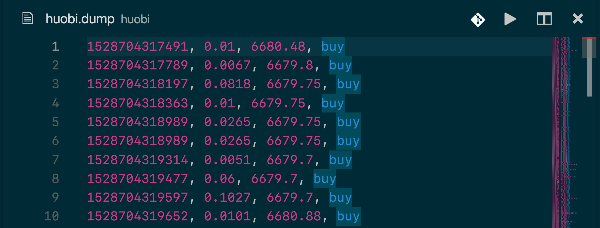

# huobi

## Project Overview

The aim of this project was to log trade data from huobi exchange.

## Files

* huobi.py

Websocket client written in Python to log trade data from Huobi exchange to external DUMP files.

## Output

Sample of a DUMP file is show below:

Information about columns is given in `huobi.py` file.

## Libraries

* websocket

For establishing websocket connection.